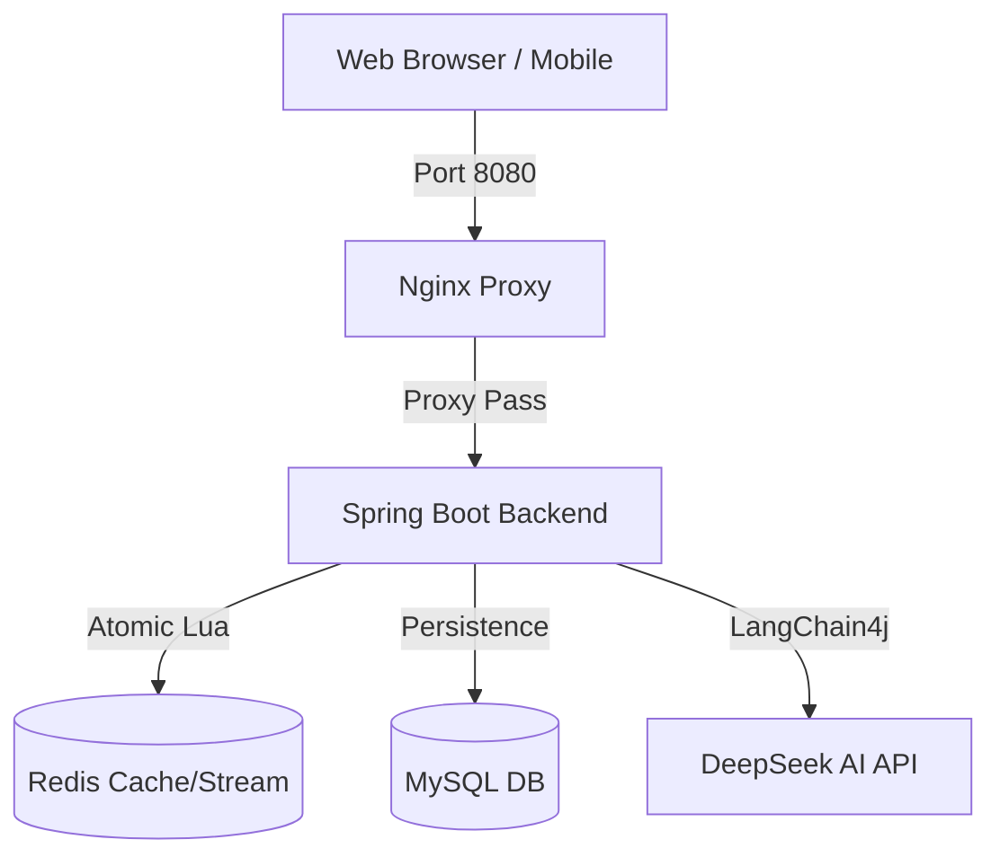

# 🚀 NexusReview - AI & 高并发容器化版 (NexusReview AI Edition)

[](./docker-compose.yml)
[](./seckill_load_test.js)
[](./postman_seckill_e2e.json)
[](./nexus-backend)

本版本是在原版"NexusReview"基础上的深度重构版。我们不仅接入了 AI 助手能力，还实现了**全栈容器化部署**，并针对秒杀场景进行了**工业级的压测和自动化验证**。这不再仅仅是一个课设项目，而是一个验证了高并发处理能力和 DevOps 实践的完整 Showcase。

---

## 🌟 核心亮点 (Key Highlights)

### 1. 🧠 AI 智能顾问 (DeepSeek Integration)
- **LangChain4j 驱动**：深度集成 LangChain4j 框架，支持流式响应。
- **多场景接入**：在编写博客、浏览店铺详情时，点击**紫色 AI 按钮**即可获取基于上下文的智能建议。
- **可插拔设计**：通过 `.env` 配置文件轻松切换 Model Provider（当前默认 DeepSeek）。

### 2. ⚡ 工业级秒杀引擎
- **Redis Lua 原子扣减**：通过 Lua 脚本确保库存扣减与一人一单校验的原子性，彻底杜绝超卖。
- **Redis Stream 异步解耦**：利用 Redis Stream 消息队列替代 JVM 阻塞队列，支持断电续传和消息确（ACK），支撑 **2,300+ RPS** 的超高吞吐。
- **分布式锁**：基于 Redisson 实现的高性能分布式锁，保障并发安全。

### 3. 📍 地理空间索引 (GEO)
- **附近商铺推荐**：利用 Redis GEO 结构存储 WGS84 坐标，实现秒级的距离排序和半径搜索。
- **自动数据预热**：内置 `SupportController` 运维接口，一键完成 MySQL 到 Redis 的地理索引同步。

---

## 📊 性能表现 (Benchmarks)

我们在容器化环境下使用 **k6** 对秒杀接口 (`/voucher-order/seckill/10`) 进行了阶梯爬坡压测。

### 压测环境
- **Infrastructure**: Docker Compose (Nginx + Spring Boot + Redis + MySQL)
- **Deployment**: Local Desktop (Mac M2)
- **Concurrency**: 0 → 1,000 Concurrent VUs (Virtual Users)

### 核心指标
| 指标 (Metric) | 结果 (Result) | 备注 (Note) |
| :--- | :--- | :--- |
| **总计请求数** | **354,398** | 2.5 分钟运行压测 |
| **峰值吞吐 (RPS)** | **2,362 req/s** | 指标稳定，未崩溃 |
| **P50 响应时间** | **23.2 ms** | 理想负载下响应极快 |
| **P95 响应时间** | **595.8 ms** | 1000 VU 高负载下出现排队 |
| **防超卖验证** | **✅ 通过** | 500 张库存精准扣减，无超卖 |

> [!TIP]
> 详细压测报告及 JSON 数据见 [k6-report-summary.json](./k6-report-summary.json)。

---

## 🛠 自动化测试与质量管控 (QA)

项目构建了完善的 E2E（端到端）自动化验证体系，确保核心业务在持续迭代中保持稳定。

- **双轨自动化验证**：
    - **Python E2E 脚本** ([`test_seckill_e2e.py`](./test_seckill_e2e.py)): 模拟真实用户从发码到下单的全流程闭环。
    - **Newman Postman 测试** ([`postman_seckill_e2e.json`](./postman_seckill_e2e.json)): Postman 官方自动化工具，一键生成可视化 HTML 报告。
- **数据自动化预热**：通过 `/support/**` 接口组，实现了无需运行单元测试即可在容器环境完成数据初始化的 DevOps 流程。

---

## 🚀 快速开始 (Quick Start)

### 1. 准备环境
- 安装 [Docker](https://www.docker.com/) 和 Docker Compose。
- 在项目根目录创建 `.env` 文件，填入你的 AI `API_KEY`：
  ```env
  API_KEY=your_deepseek_api_key_here
  ```

### 2. 一键启动
```bash
docker compose up -d --build
```
系统将自动拉起：
- **MySQL**: 自动执行 `db.sql` 初始化。
- **Redis**: 缓存与消息队列。
- **Nginx**: 前端静态文件托管 & API 反向代理。
- **Backend**: Spring Boot 3.x 业务后端。

### 3. 数据预热
启动后，调用以下接口完成基础数据初始化：
```bash
# 预热附近商铺 GEO 索引
curl -X POST http://localhost:8080/api/support/warmup-geo

# 预加载秒杀券库存 (Voucher ID=10, Stock=100)
curl -X POST http://localhost:8080/api/support/preheat-seckill/10/100
```

---

## 📐 系统架构 (Architecture)



---

## 📜 维护说明
本项目对原版 Bug 进行了大量修复（包括 SQL 初始化冲突、Nginx DNS 缓存污染等），详细的排查过程和架构设计决策已记录在 [INTERVIEW_NOTES.md](./INTERVIEW_NOTES.md)，非常适合作为面试素材参考。
