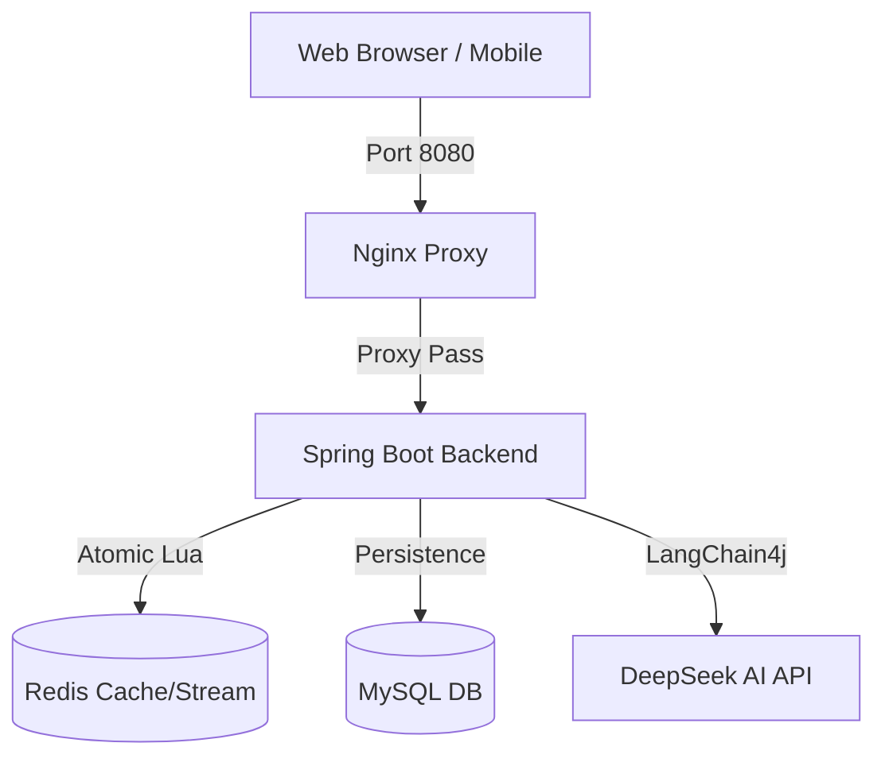

# NexusReview - AI & High-Concurrency Containerized Edition (NexusReview AI Edition)

[](./docker-compose.yml)
[](./seckill_load_test.js)
[](./postman_seckill_e2e.json)
[](./nexus-backend)

This version is a deeply refactored edition of the original review system. We have integrated AI assistant capabilities, implemented full-stack containerized deployment, and conducted industry-grade load testing and automated verification for high-concurrency seckill scenarios. This is no longer just a project; it is a complete showcase of high-concurrency processing power and DevOps practices.

---

## Key Highlights

### 1. AI Intelligent Consultant (DeepSeek Integration)
- **LangChain4j Driven**: Deeply integrated with the LangChain4j framework, supporting streaming responses.
- **Multi-Scenario Access**: Click the purple AI button while writing blogs or browsing shop details to get intelligent suggestions based on context.
- **Pluggable Design**: Easily switch Model Providers (currently defaulting to DeepSeek) via the .env configuration file.

### 2. Industry-Grade Seckill Engine
- **Redis Lua Atomic Deduction**: Uses Lua scripts to ensure the atomicity of stock deduction and "one order per person" validation, completely preventing overselling.
- **Redis Stream Asynchronous Decoupling**: Replaced JVM blocking queues with Redis Stream message queues, supporting resume-from-break and message acknowledgement (ACK), sustaining a high throughput of over 2,300 RPS.
- **Distributed Locking**: High-performance distributed locks based on Redisson to ensure concurrency safety.

### 3. Geospatial Indexing (GEO)
- **Nearby Shop Recommendations**: Utilizes Redis GEO structures to store WGS84 coordinates, achieving second-level distance sorting and radius searches.
- **Automatic Data Warming**: Built-in SupportController maintenance interface to sync geospatial indexing from MySQL to Redis with one click.

---

## Performance Benchmarks

We conducted ramp-up load testing using k6 on the seckill interface (/voucher-order/seckill/10) in a containerized environment.

### Test Environment
- **Infrastructure**: Docker Compose (Nginx + Spring Boot + Redis + MySQL)
- **Deployment**: Local Desktop (Mac M2)
- **Concurrency**: 0 to 1,000 Concurrent VUs (Virtual Users)

### Metrics
| Metric | Result | Note |
| :--- | :--- | :--- |
| **Total Requests** | **354,398** | 2.5 minutes test duration |
| **Peak Throughput (RPS)** | **2,362 req/s** | Metrics remained stable |
| **P50 Response Time** | **23.2 ms** | Extremely fast under ideal load |
| **P95 Response Time** | **595.8 ms** | Queuing occurred at 1,000 VU high load |
| **Overselling Validation** | **Pass** | 500 units of stock accurately deducted |

> [!NOTE]
> Detailed benchmark reports and JSON data can be found in [k6-report-summary.json](./k6-report-summary.json).

---

## Automated Testing & Quality Assurance (QA)

The project has established a comprehensive E2E (End-to-End) automated verification system to ensure stability during continuous iteration.

- **Dual-Track Automated Verification**:
    - **Python E2E Script** ([test_seckill_e2e.py](./test_seckill_e2e.py)): Simulates a full closed-loop user experience from code generation to ordering.
    - **Newman Postman Testing** ([postman_seckill_e2e.json](./postman_seckill_e2e.json)): Postman's official automation tool, generating visual HTML reports with one click.
- **Data Automated Warming**: Through the /support/** interface group, we achieved a DevOps process for initializing data in a containerized environment without running unit tests.

---

## Quick Start

### 1. Prepare Environment
- Install Docker and Docker Compose.
- Create a .env file in the project root directory and enter your AI API_KEY:
  ```env
  API_KEY=your_deepseek_api_key_here
  ```

### 2. One-Click Launch
```bash
docker compose up -d --build
```
The system will automatically start:
- **MySQL**: Automatically executes db.sql for initialization.
- **Redis**: Cache and message queue.
- **Nginx**: Front-end static file hosting & API reverse proxy.
- **Backend**: Spring Boot 3.x business backend.

### 3. Data Warming
After starting, call the following interfaces to complete basic data initialization:
```bash
# Warm up nearby shop GEO indexing
curl -X POST http://localhost:8080/api/support/warmup-geo

# Preheat seckill stock (Voucher ID=10, Stock=100)
curl -X POST http://localhost:8080/api/support/preheat-seckill/10/100
```

---

## System Architecture



---

## Maintenance Notes
This project fixes numerous bugs from the original version (including SQL initialization conflicts, Nginx DNS cache pollution, etc.). Detailed troubleshooting processes and architectural design decisions are documented in [INTERVIEW_NOTES.md](./INTERVIEW_NOTES.md), which is excellent reference material for interviews.
